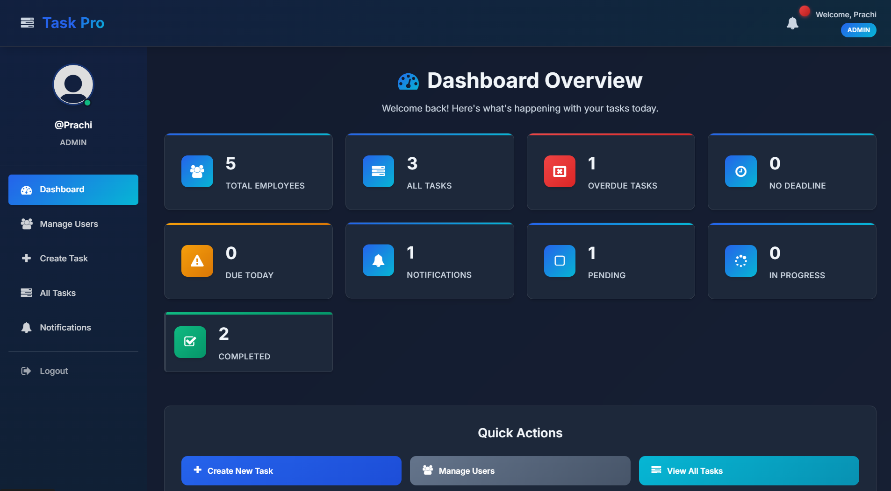
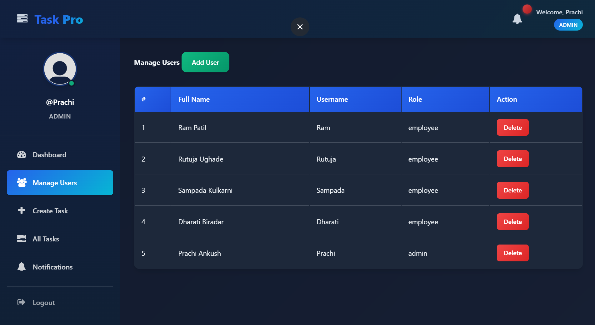
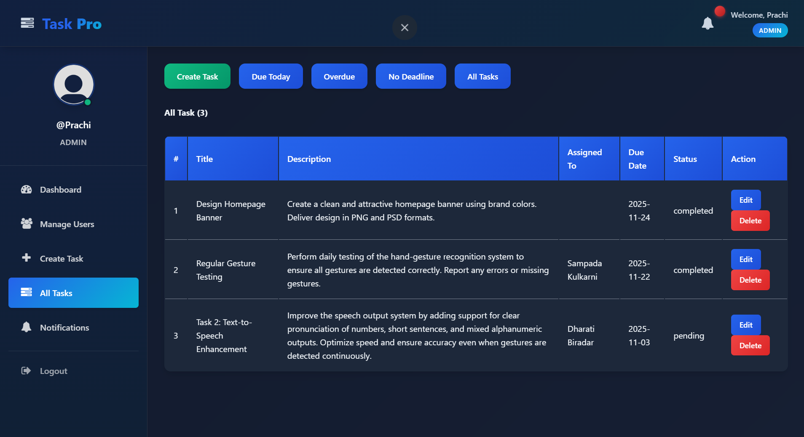
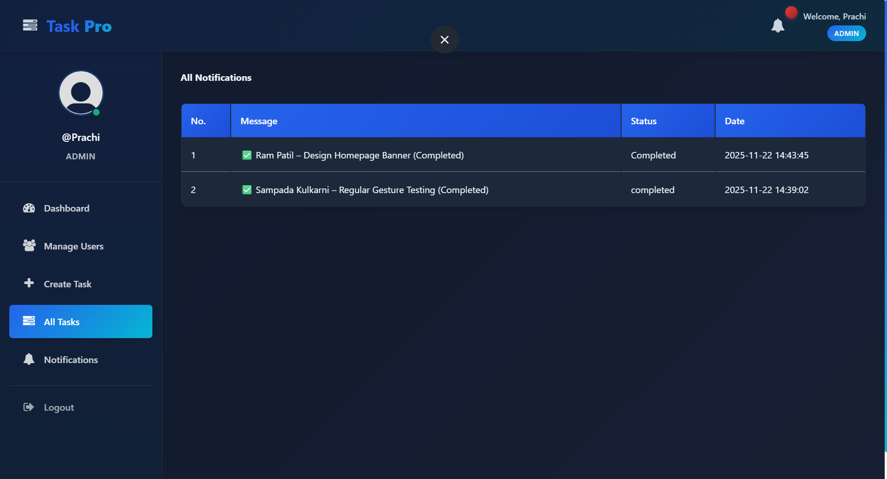

# 🚀 TaskPro – Smart Team Collaboration Platform

**TaskPro** is a full-stack **task management and team collaboration system** designed to help teams organize, assign, and track tasks efficiently.

The platform allows multiple users to **create tasks, assign responsibilities, track deadlines, and monitor progress**. It also includes **secure authentication and role-based access control** to ensure proper management of user permissions.

This project was developed using **PHP and MySQL** and runs locally using **XAMPP**.

---

# 📌 Project Overview

Managing tasks in a team can become difficult without a proper system. TaskPro provides a **centralized platform** where team members can:

* create and assign tasks
* track deadlines
* monitor task progress
* manage team members

The system helps improve **team productivity and task transparency**.

---

## ✨ Features

- ✅ User Authentication (Login / Signup)
- ✅ Role-Based Access Control
- ✅ Create and Assign Tasks
- ✅ Task Deadline Management
- ✅ Task Status Tracking
- ✅ User Profile Management
- ✅ Notification System
- ✅ Task Editing and Deletion

---

# 🛠 Technologies Used

### Frontend

* HTML
* CSS
* JavaScript

### Backend

* PHP

### Database

* MySQL

### Development Environment

* XAMPP

---

# 📂 Project Folder Structure

```
TaskPro
│
├── app/
├── css/
├── img/
├── inc/
│
├── add-user.php
├── create_task.php
├── delete-task.php
├── delete-user.php
├── edit-task.php
├── edit-task-employee.php
├── edit_profile.php
├── index.php
├── login.php
├── logout.php
├── my_task.php
├── notifications.php
├── profile.php
├── signup.php
├── tasks.php
├── user.php
│
├── DB_connection.php
├── DB.sql
├── task_management_db.sql
└── .hintrc
```
## 📸 Project Screenshots

### 🏠 Dashboard


---

### 👥 User Management

<p align="center">
  
  
</p>

---

### 📝 Task Management

<p align="center">
  
  
</p>

---

### 🔔 Notifications

<p align="center">
  
</p>
---

# ⚙️ System Requirements

* PHP 7.4 or higher
* MySQL Database
* Local server environment such as **XAMPP**
* Web Browser (Chrome, Edge, etc.)

---

# 💻 Installation Guide

### 1️⃣ Clone the Repository

```bash
git clone https://github.com/prachi-ankush-3/taskpro.git
```

---

### 2️⃣ Move Project to XAMPP

Copy the project folder to:

```
xampp/htdocs/
```

---

### 3️⃣ Start Apache and MySQL

Open **XAMPP Control Panel** and start:

* Apache
* MySQL

---

### 4️⃣ Import Database

1. Open **[http://localhost/phpmyadmin](http://localhost/phpmyadmin)**
2. Create a new database
3. Import the file:

```
task_management_db.sql
```

---

### 5️⃣ Run the Project

Open your browser and go to:

```
http://localhost/Employee-Task-Management-System-using-PHP-and-MySQL-main
```

---

# 🔐 Authentication System

The system includes **secure login and signup functionality**.
Users can create accounts and log in to manage tasks.

Role-based access control ensures that **only authorized users can perform specific actions**.

---

# 📈 Key Functionalities

### Task Management

Users can create tasks and assign them to team members.

### Deadline Tracking

Each task includes a deadline to ensure proper time management.

### Notifications

Users receive notifications about task updates.

### User Management

Admins can manage user profiles and roles.

---

# 🎯 Purpose of the Project

The goal of this project is to create a **smart collaboration platform** that simplifies task management and improves communication within teams.

It demonstrates concepts of:

* full-stack web development
* authentication systems
* database integration
* role-based access control

---

# 🔮 Future Improvements

* Email notifications for tasks
* Real-time updates using AJAX
* Task progress charts and analytics
* Mobile responsive design
* File attachments for tasks

---

# 👩‍💻 Author

**Prachi Ankush**


---
